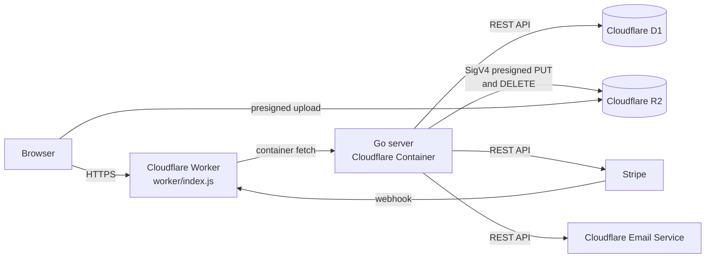
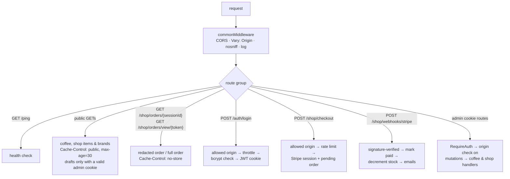
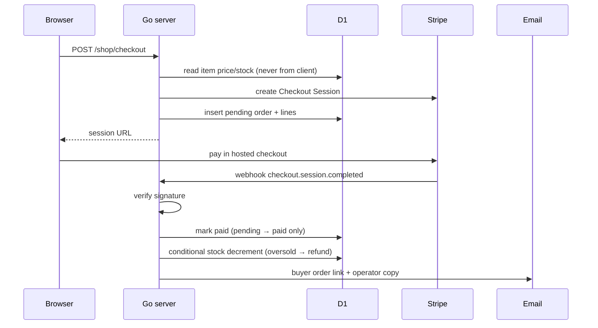

# thom-server

HTTP API for the coffee journal, backing
[thom-website](https://github.com/thomhuang/thom-website).
Currently following along `Let's Go` by Alex Edwards: https://lets-go.alexedwards.net/

## Request flow

How a request reaches the API and which route groups apply which middleware:



Inside the Go server every request passes `commonMiddleware` (CORS, `Vary:
Origin`, `nosniff`, request log), then the route determines the remaining
guards:



Checkout is the most involved flow — the price always comes from the database,
and payment confirmation arrives through the webhook rather than the browser:



## Deployment

The server runs on Cloudflare: the Go binary runs as a Cloudflare Container and
stores data in Cloudflare D1. Two environments deploy from this repository —
production (`wrangler.jsonc` → `thom-server`) and test
(`wrangler.test.jsonc` → `thom-server-test`). See [CLOUDFLARE.md](CLOUDFLARE.md)
for setup, secrets, data import, and deployment. There is no local database:
local development points at the test D1 database and test R2 bucket, and Go
tests use in-memory SQLite.

```sh
npx wrangler deploy                        # production
npx wrangler deploy -c wrangler.test.jsonc # test
```

## Routes

Public:

- `GET /ping`
- `GET /coffee`, `GET /coffee/roasters`, `GET /coffee/grinders`, `GET /coffee/{id}`
- `GET /shop/items`, `GET /shop/items/{id}`, `GET /shop/brands` (admins also see drafts)
- `GET /shop/orders/{sessionId}` (lookup by unguessable Stripe session id)
- `GET /shop/orders/view/{token}` (magic link emailed after payment; returns the full order)
- `POST /auth/login`, `POST /shop/checkout`, `POST /shop/webhooks/stripe`

Authenticated with the session cookie:

- `GET /auth/me`, `POST /auth/logout`
- `POST /coffee`, `PATCH /coffee/{id}`, `DELETE /coffee/{id}`
- `POST /coffee/roasters`, `POST /coffee/grinders`
- `POST /shop/items`, `PATCH /shop/items/{id}`, `DELETE /shop/items/{id}`
- `POST /shop/items/{id}/images/presign`, `POST /shop/items/{id}/images`, `DELETE /shop/items/{id}/images/{imageId}`
- `POST /shop/brands`, `GET /shop/orders`

## Local development

```sh
cp .env.example .env.local   # non-secret config only
.\scripts\dev-op.ps1         # 1Password-injected secrets + go run, API on :4000
# or, on any shell with the 1Password CLI installed:
op run --env-file=.env.op -- go run ./cmd/server
```

`go run ./cmd/server` loads `.env.local` before reading the environment, and
existing shell or container variables take precedence. The server has no local
database: `.env.example` points `D1_DATABASE_ID` and the R2 values at the
**test** environment (`wrangler.test.jsonc`). Keep the **non-secret** values in
`.env.local` and run the server through `scripts/dev-op.ps1`, which resolves the
secrets from 1Password. The server refuses to start without D1 configured.

### Secrets (1Password)

Secrets are referenced, never stored in the repo: the committed `.env.op` holds
`op://` paths for `CF_API_TOKEN`, `R2_ACCESS_KEY_ID`, `R2_SECRET_ACCESS_KEY`,
`STRIPE_SECRET_KEY`, `STRIPE_WEBHOOK_SECRET`, `EMAIL_API_TOKEN`,
`ADMIN_PASSWORD_HASH`, and `JWT_SECRET`. `scripts/dev-op.ps1` runs `op run`, so
1Password resolves those fields and injects them into the server process only —
nothing is written to disk and your shell is left untouched.

One-time setup: install the desktop app and CLI (desktop first), then open a new
shell so `op` is on `PATH`:

```powershell
winget install --id AgileBits.1Password --accept-package-agreements --accept-source-agreements
winget install --id AgileBits.1Password.CLI --accept-package-agreements --accept-source-agreements
```

In the desktop app, enable **Settings → Developer → Integrate with 1Password
CLI** and Windows Hello, and set a short auto-lock. Then create a vault
`thom-dev` with one LOGIN item per secret above, titled after the variable, with
the value in the item's `password` field. `.env.op` maps each variable to
`op://thom-dev/<item title>/password`.

Run the server with:

```powershell
.\scripts\dev-op.ps1       # op run + go run ./cmd/server
```

To run the real container locally instead, use the test Wrangler config so its
vars point at test:

```sh
npx wrangler dev -c wrangler.test.jsonc   # needs Docker and .dev.vars
```

```sh
go test ./...           # in-memory SQLite, no C toolchain needed
go test ./internal/d1/  # D1 driver tests only
go build ./cmd/server
```

## Configuration

JWT cookie auth is configured with environment variables:

- `ADMIN_USERNAME`: admin login username.
- `ADMIN_PASSWORD_HASH`: bcrypt hash of the admin login password.
- `JWT_SECRET`: long random secret used to sign auth cookies.
- `CLIENT_ORIGIN_URLS`: comma-separated frontend origins allowed to send cookies.
- `SECURE_COOKIES`: set to `true` in HTTPS environments; this also switches the auth cookie to the `__Host-` prefixed name. The cookie is always `SameSite=Lax`, since the API is same-origin with the site.
- `D1_ACCOUNT_ID`, `D1_DATABASE_ID`, `CF_API_TOKEN`, `D1_ENDPOINT`: required. The server only talks to Cloudflare D1. `D1_DATABASE_ID` selects test or production and `D1_ENDPOINT` defaults to the public Cloudflare API. `CF_API_TOKEN` is a secret and is never committed.
- `EMAIL_ACCOUNT_ID`, `EMAIL_FROM`, `EMAIL_FROM_NAME`, `EMAIL_API_TOKEN`, `PUBLIC_SITE_URL`: buyer order-link email via Cloudflare Email Service. Order email is disabled unless the account id, from address, and token are all set. `PUBLIC_SITE_URL` defaults to the first `CLIENT_ORIGIN_URLS` entry.
- `ORDER_NOTIFICATION_EMAIL`: optional address that receives a copy of every paid order (best-effort). Unset means disabled.
- `STRIPE_TAX_ENABLED` (default `false`): enable Stripe Tax; leave off until tax registrations are configured.
- `STRIPE_SHIPPING_CENTS` (default `1000`): flat US shipping line in cents; set `0` for free shipping.

Generate a bcrypt password hash with the repository helper (it uses the same
`golang.org/x/crypto/bcrypt` version and cost the server verifies against):

```sh
echo "your-password" | go run ./tools/bcryptgen
```

The raw password is submitted to `POST /auth/login` from the browser, but HTTPS
protects it in transit and the server only stores/verifies the bcrypt hash.
